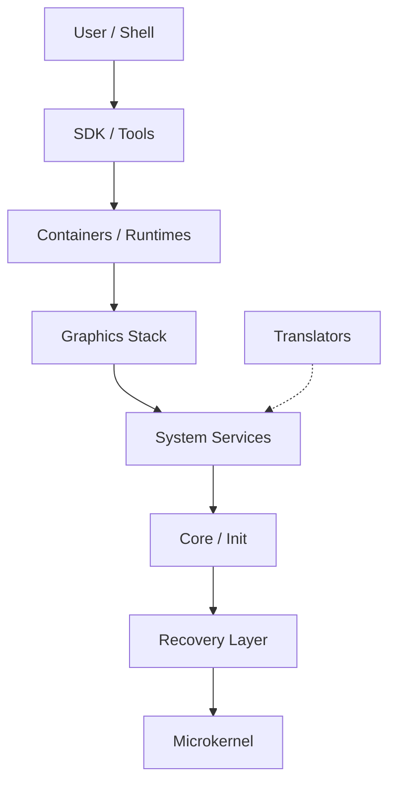

# MosaicOS Architecture

MosaicOS is designed as a modular, microkernel-based operating system. The architecture is organized into eight distinct layers, each with clear responsibilities and isolation boundaries.

## Architectural Layers

### 1. Microkernel Layer
- **Responsibility:** Low-level hardware abstraction, memory management, thread scheduling, and Inter-Process Communication (IPC) primitives.
- **Not Responsible For:** Device drivers, filesystems, or system policy.
- **Foundational Component:** L4Re / Fiasco.OC or similar L4-based kernel.

### 2. Recovery Layer (The Guardian)
- **Responsibility:** Monitoring system health, managing watchdogs, and orchestrating recovery actions (restart, fallback, rollback).
- **Not Responsible For:** Application-level logic.
- **Key Feature:** Self-healing is a first-class citizen.

### 3. Core Layer (Init & Base Services)
- **Responsibility:** Initial system bootstrap (`mosaic-init`), service orchestration, capability management, and basic resource allocation.
- **Not Responsible For:** High-level graphical interface or complex application runtimes.

### 4. System Services Layer
- **Responsibility:** User-space drivers, network stack, filesystem services, and hardware management.
- **Not Responsible For:** Rendering application windows or managing user sessions.

### 5. Graphics Stack Layer
- **Responsibility:** Display management, window composition, input routing, and GUI protocols.
- **Not Responsible For:** General-purpose application logic.

### 6. Translators Layer
- **Responsibility:** Exposing diverse resources (S3, databases, APIs) as filesystem nodes, inspired by GNU Hurd.
- **Not Responsible For:** Permanent local storage management.

### 7. Runtimes & Containers Layer
- **Responsibility:** Isolated execution environments for applications (Native, WASM, Linux personality).
- **Not Responsible For:** Direct hardware access.

### 8. Shell, SDK & Tools Layer
- **Responsibility:** User interface (Desktop Shell), developer tools (`mosaicctl`), and system libraries.

## Communication Model
- **IPC Only:** All communication between isolated components MUST happen via IPC.
- **Capabilities:** Access to services and resources is governed by capabilities.
- **Isolation:** Components run in their own address spaces. No shared memory across isolation boundaries unless explicitly managed via capability-protected memory objects.
