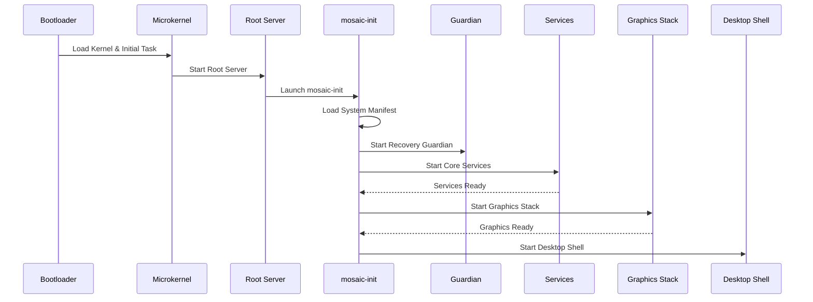

# MosaicOS Boot Flow

This document describes the sequence of events from hardware power-on to the fully initialized graphical desktop environment.

## Boot Sequence

1. **Bootloader (GRUB/u-boot)**
   - Loads the microkernel and the initial bootstrap task into memory.
   - Passes system parameters and multi-boot information.

2. **Microkernel (L4 Foundation)**
   - Initializes CPU, memory management, and basic IPC.
   - Starts the **Initial Task** (Root Server).

3. **Initial Task / Root Server**
   - Sets up the basic system environment.
   - Launches `mosaic-init` as the first user-space management process.

4. **mosaic-init (The Orchestrator)**
   - Loads and parses the **System Manifest**.
   - Starts the **Recovery Layer** (Guardian).
   - Resolves dependencies and starts core services.

5. **Core Services**
   - Logging, Storage, and Device Management services start.
   - If a required service fails, `mosaic-init` consults the recovery policy.

6. **Graphics Stack**
   - `display-server` initializes the framebuffer.
   - `compositor` and `input-server` start.

7. **Desktop Shell**
   - Launches the graphical user interface.
   - Ready for user interaction.

## Mermaid Sequence Diagram



## System Manifest (v0.1)

The system manifest describes the desired state of the MosaicOS environment.

```yaml
system:
  name: MosaicOS
  profile: development # development, production, recovery

boot:
  target: graphical
  init: /system/core/mosaic-init

services:
  logger:
    binary: /system/services/logd
    restart: always

  storage:
    binary: /system/services/storaged
    requires:
      - logger
    capabilities:
      - disk.read
      - disk.write

  display:
    binary: /system/graphics/displayd
    requires:
      - device-manager

graphical:
  shell: /system/shell/desktop-shell

recovery:
  default_policy: restart_then_fallback
  snapshots:
    enabled: true
    before_updates: true
```

## Failure Handling during Boot
- If a **critical** service fails to start, `mosaic-init` will attempt recovery based on the manifest.
- If recovery fails for a critical boot service, the system may fall back to `safe-gui` or a `recovery-shell`.
